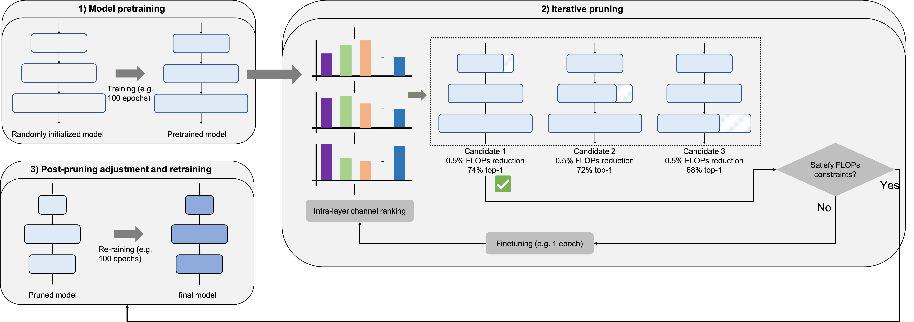

# Augment deep BP-parameter learning with local XAI-structural learning

This repository contains the PyTorch implementation of the paper [Augment deep BP-parameter learning with local XAI-structural learning](https://www.intlpress.com/site/pub/files/_fulltext/journals/cis/2020/0020/0003/CIS-2020-0020-0003-a003.pdf).

### Highlight
Neural network pruning has become the de facto tool to accelerate deep neural networks for mobile and edge applications. We consider feature-map discriminant based channel pruning, as it aligns well with the CNN’s objective of differentiating multiple classes and offers better interpretability of the pruning decision. However, previous discriminant based methods are challenged by computation inefficiency, as there is a lack of theoretical guidance on quantifying the feature-map discriminant power. We develop a mathematical formulation to accurately and efficiently quantify the feature-map discriminativeness, based on which we can identify and remove those channels with minimum influence to the discriminant power. We propose an iterativee pruning algorithm to automatically evolve the model structure to satisfy the resource budget.

<div align="center">
  
</div>

* This repo was built upon the [DeepLearningExamples](https://github.com/NVIDIA/DeepLearningExamples). Installation and setup of NVIDIA docker follows that repo.

### Prepare the dataset

* We use ImageNet-1K. [Download the images](http://image-net.org/download-images).

* Extract the training data:
```Shell
mkdir train && mv ILSVRC2012_img_train.tar train/ && cd train
tar -xvf ILSVRC2012_img_train.tar && rm -f ILSVRC2012_img_train.tar
find . -name "*.tar" | while read NAME ; do mkdir -p "${NAME%.tar}"; tar -xvf "${NAME}" -C "${NAME%.tar}"; rm -f "${NAME}"; done
cd ..
```

* Extract the validation data and move the images to subfolders:
```Shell
mkdir val && mv ILSVRC2012_img_val.tar val/ && cd val && tar -xvf ILSVRC2012_img_val.tar
wget -qO- https://raw.githubusercontent.com/soumith/imagenetloader.torch/master/valprep.sh | bash
```

### Three stages in the DI iterative pruning:
Example of compressing ResNet-50 model on ImageNet-1K using 8 GPUs:

#### Pretraining

```Shell
python ./multiproc.py --nproc_per_node 8 ./main.py /data/imagenet \
  --data-backend dali-cpu \
  --raport-file raport.json \
  -j8 -p 100 \
  --lr 1.024 \
  --optimizer-batch-size 1024 \
  --warmup 5 \
  --arch resnet50 \
  -c fanin \
  --label-smoothing 0.1 \
  --lr-schedule cosine \
  --mom 0.875 \
  --wd 3.0517578125e-05 \
  -b 128 \
  --amp --static-loss-scale 128 \
  --epochs 120 \
  --mixup 0.2 
```

#### Iterative pruning

```Shell
python ./multiproc.py --nproc_per_node 8 ./main.py /data/imagenet \
  --data-backend dali-cpu \
  --raport-file raport.json \
  -j8 -p 100 \
  --lr 0.01024 \
  --optimizer-batch-size 1024 \
  --warmup 0 \
  --arch resnet50 \
  -c fanin \
  --label-smoothing 0.1 \
  --lr-schedule constant \
  --mom 0.875 \
  --wd 3.0517578125e-05 \
  -b 128 
  --amp --static-loss-scale 128 \
  --epochs 50 \
  --mixup 0.2 \
  --pretrained-weights ./logs/pretrained.pth.tar \
  --gather-checkpoints \
  --iterative_pruning \
  --pruning_step 50 \
  --pruning_delta 5e-3
```

* `--pretrain-weight`: set to the pretrained model checkpoint obtained from the frist stage.

#### Finetuning

```Shell
python ./multiproc.py --nproc_per_node 8 ./main.py /data/imagenet \
  --data-backend dali-cpu \
  --raport-file raport.json \
  -j8 -p 100 \
  --lr 0.1024 \
  --optimizer-batch-size 1024 \
  --warmup 5 \
  --arch resnet50 \
  -c fanin \
  --label-smoothing 0.1 \
  --lr-schedule cosine \
  --mom 0.875 \
  --wd 3.0517578125e-05 \
  -b 128 \
  --amp --static-loss-scale 128 \
  --epochs 120 \
  --mixup 0.2 \
  --pretrained-weights ./zj_checkpoints/checkpoint-27.pth.tar \
```

* `--pretrained-weights`: set to the pruned model checkpoint obtained from the second stage.

### Checkpoints
We provide our compressed ResNet-50 models on ImageNe:

<table>
  <tr>
    <th>Model</th>
    <th>Top-1</th>
    <th>FLOPS reduction</th>
    <th>Checkpoints</th>
  </tr>
  <tr>
    <td rowspan="2">ResNet-50</td>
    <td>78.3%</td>
    <td>27%</td>td>
    <td><a href="">resnet50_3GFLOPS.pth.tar</a></td>   
  </tr>
  <tr>
    <td>76.7%</td>
    <td>67%</td>td>
    <td><a href="">resnet50_1.5GFLOPS.pth.tar</a></td>
  </tr>
</table>

#### Evaluation

* Example of evaluating the compressed ResNet-50 on ImageNet-1K:

```Shell
CUDA_VISIBLE_DEVICES=0 python ./main.py /data/imagenet \
    --data-backend dali-cpu \
    --arch resnet50 \
    --evaluate \
    --epochs 1 \
    --pretrained-weights resnet50_3GFLOPS.pth.tar \
    -b 100
```

### Citation
If you find this repository helpful, please consider citing:

```Shell
@article{kung2020augment,
  title={Augment deep BP-parameter learning with local XAI-structural learning},
  author={Kung, Sun-Yuan and Hou, Zejiang},
  journal={Communications in Information and Systems},
  volume={20},
  number={3},
  pages={319--352},
  year={2020},
  publisher={International Press of Boston}
}
```


